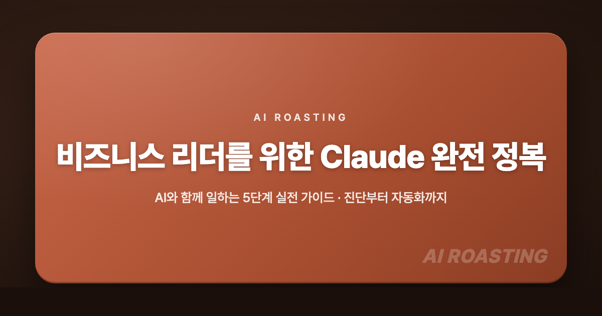

  

# AI ROASTING · AI 에이전트를 고용하라

프롬프트에서 하네스·루프까지, 대화를 실행으로 바꾸는 5단계. Claude·ChatGPT·Hermes 실전 가이드.

🔗 **Live Site:** [airoasting.vercel.app](https://airoasting.vercel.app)

---

## 커리큘럼 구조

### 준비. 소개와 진단
| 페이지 | 설명 |
|--------|------|
| [Claude·ChatGPT 5분 오리엔테이션](https://airoasting.vercel.app/orientation.html) | 이름의 유래, 열 가지 기능의 출시 시점, 기업 도입률, 벤치마크와 가격을 두 서비스로 나누어 비교 |
| [모델의 자기소개](https://model.airoasting.com/) | 최신 모델이 스스로를 어떻게 묘사하는지 살펴보는 자기소개 모음(외부 사이트) |
| [나는 지금 몇 단계일까?](https://airoasting.vercel.app/ai-levels.html) | 자율주행 0~5단계 비유로 내 AI 활용 수준과 다음에 배울 것을 진단 |

### 1단계. 소환: 멀티 페르소나

**기본기**

| 페이지 | 설명 |
|--------|------|
| [프롬프트 잘 쓰는 법](https://airoasting.vercel.app/ai-fluency.html) | 최신 모델에서 통하지 않는 옛 프롬프트 방식과 지금 권장되는 방식을 항목별로 비교 |
| [멀티 페르소나 토론](https://airoasting.vercel.app/multi-persona.html) | 역할을 나눈 전문가 페르소나에게 토론시켜 결론을 검증하는 방법 |
| [프로젝트 만들기](https://airoasting.vercel.app/project-intro.html) | 지침과 파일을 한 번 설정해 대화마다 같은 조건을 다시 설명하지 않는 법 |

**검증**

| 페이지 | 설명 |
|--------|------|
| [AI의 동조를 줄이는 법](https://airoasting.vercel.app/ai-sycophancy.html) | 연구로 검증된 다섯 가지 질문법으로 맞장구 대신 약점을 끌어내기 |
| [AI의 환각을 벗어나는 법](https://airoasting.vercel.app/ai-hallucination.html) | EY·KPMG 보고서에서 실제로 발생한 가짜 각주 사례와 3분 안에 검증하는 절차 |

### 2단계. 연결: 바이브 코딩

**노코드 트랙**

| 페이지 | 설명 |
|--------|------|
| [바이브 코딩 101](https://airoasting.vercel.app/vibe-coding-101.html) | Claude Code와 Codex, 터미널 없이 앱에서 설치부터 첫 실행까지 |
| [바이브 코딩 실전 과제 9가지](https://airoasting.vercel.app/vibe-coding-tasks.html) | 스탑워치부터 엑셀 기반 시사점·PPT·지식 그래프까지 난이도순 아홉 과제 |
| [GitHub · Vercel · Netlify](https://airoasting.vercel.app/github-guide.html) | 결과물을 올리고 웹 주소로 접속하기까지 한 번에 |

**CLI 트랙**

| 페이지 | 설명 |
|--------|------|
| [터미널 CLI 20단계로 따라하기](https://airoasting.vercel.app/checklist.html) | 설치부터 첫 실행까지 20개 항목 점검표, 설치 명령은 운영체제별로 |
| [명령어 모음](https://airoasting.vercel.app/cheatsheet.html) | 슬래시 명령어 60개와 단축키, 세 가지 모드. 먼저 익힐 12개는 따로 표시 |

### 3단계. 계약: 하네스

**하네스 엔지니어링**

| 페이지 | 설명 |
|--------|------|
| [하네스 엔지니어링이란?](https://airoasting.vercel.app/harness-engineering.html) | 모델을 감싸는 환경 설계가 결과를 바꾸는 이유와 하네스의 구성 요소 |
| [나만의 Skill 만들기](https://airoasting.vercel.app/skills.html) | 반복해 설명하던 형식과 말투를 스킬로 저장해 한 줄로 호출하기 |
| [AGENTS.md로 내 규칙 알려주기](https://airoasting.vercel.app/agents-md-templates.html) | AGENTS.md·CLAUDE.md·MEMORY.md 세 파일로 반복하던 규칙 설명을 대체하는 템플릿 |

**도구**

| 페이지 | 설명 |
|--------|------|
| [에이전트의 도구란?](https://airoasting.vercel.app/agent-tools.html) | 내장 도구·MCP·커넥터·스킬·플러그인 다섯 가지의 차이와 관계를 한 지도로 |
| [스킬·MCP를 플러그인으로 묶기](https://airoasting.vercel.app/code-plugin.html) | 스킬과 MCP를 한 폴더로 묶어 팀에 한 줄 명령으로 배포하기 |
| [MCP 연결 실전](https://airoasting.vercel.app/mcp-examples.html) | 구글 드라이브·카카오톡·DART 공시·법령 검색·Liner·텔레그램 여섯 가지를 Claude에 연결 |

### 4단계. 조합: 멀티 에이전트

| 페이지 | 설명 |
|--------|------|
| [멀티 에이전트 소환](https://airoasting.vercel.app/harness-workflows.html) | `/goal`로 목표를 고정하고 큰 작업을 여러 에이전트에 나눠 맡기는 절차 |
| [하네스 엔지니어링으로 책 쓰기](https://airoasting.vercel.app/harness-book.html) | 기획서 한 장과 명령 네 개, AI 리뷰어 9명의 검수로 책 한 권 분량 초안을 만드는 실전 예제 |
| [5 Color](https://5color.airoasting.com/) | 수행자 한 명과 비평가 네 명을 색으로 나눠 합격선까지 다시 만드는 협업 방법론(외부 사이트) |
| [50 에이전트 팀 빌더](https://50agents.airoasting.com/) | 목적 한 줄로 검증된 에이전트 50명 중에서 팀을 꾸리기(외부 사이트) |
| [25인 자문단](https://council.airoasting.com/) | 25명의 페르소나가 서로 다른 관점에서 토론하는 자문단(외부 사이트) |

### 5단계. 자율: 루프

| 페이지 | 설명 |
|--------|------|
| [루프 엔지니어링이란?](https://airoasting.vercel.app/loop-engineering.html) | 목표 조건을 만족할 때까지 AI가 스스로 반복 실행하는 구조 설계 |
| [Routines 예약 실행](https://airoasting.vercel.app/routines.html) | 정해진 시각에 클라우드에서 무인으로 도는 예약형 에이전트 |

**예제: 루프로 끝까지 만든 사이트**

| 페이지 | 설명 |
|--------|------|
| [AI 정책 카탈로그](https://aipolicy2026.airoasting.com/) | 6·3 지방선거 광역단체장 16명의 AI 공약 108건을 8개 정책 분야로 정리(외부 사이트) |
| [3대 메가프로젝트](https://mega3.airoasting.com/) | 반도체·피지컬 AI·AI 데이터센터를 정부 원본과 언론 보도 126건으로 교차검증(외부 사이트) |
| [브리티시 숏헤어 백과사전](https://cat.airoasting.com/) | 초등학교 고학년도 읽을 수 있는 쉬운 말로 쓴 품종 안내서(외부 사이트) |

**스마트폰 앱: 노트북 밖에서도 이어서 쓰기**

| 페이지 | 설명 |
|--------|------|
| [스마트폰에서 Claude 쓰기](https://airoasting.vercel.app/claude-mobile.html) | 앱 메뉴 여섯 개 비교. 코드, Dispatch, 코워크의 차이와 폰에서 일 맡기는 절차 |
| [스마트폰에서 ChatGPT 쓰기](https://airoasting.vercel.app/chatgpt-mobile.html) | 폰에서 끝낼 작업과 컴퓨터에 맡길 작업 구분. 프로젝트, 예약 작업, Codex 리모트 |

---

## 수강생 쇼케이스

| 페이지 | 설명 |
|--------|------|
| [멀티 페르소나로 시 쓰기](https://airoasting.vercel.app/showcase-poems.html) | 수업 첫 실습에서 쓰고 비평하고 다시 쓴 시 47편을 여섯 묶음으로 정리 |
| [스탑워치 쇼케이스](https://airoasting.vercel.app/showcase-stopwatch.html) | 같은 한 줄 지시에서 출발한 수강생 스탑워치 42종을 라이브로 임베드한 모음 |
| [스킬 쇼케이스](https://airoasting.vercel.app/showcase-skills.html) | 수강생들이 자기 업무를 Claude 스킬로 만든 실전 자동화 25선 |

---

## 디자인·시각화 갤러리

| 페이지 | 설명 |
|--------|------|
| [EDA 차트 갤러리 28](https://airoasting.vercel.app/eda-gallery.html) | 본격적인 분석에 앞서 분포와 이상치를 확인하는 차트 28가지 |
| [UI 디자인 트렌드 30](https://airoasting.vercel.app/ui-design.html) | 같은 스탑워치를 서른 가지 스타일로 만들어 나란히 비교 |
| [UI 컴포넌트 갤러리 40](https://airoasting.vercel.app/component-gallery.html) | 이름만 지정하면 바로 만들어지는 UI 부품 40개 |
| [SVG 아이콘 300](https://airoasting.vercel.app/icon-gallery.html) | 버튼·카드에 바로 붙여 쓰는 라인 아이콘 300개, 누르면 SVG 코드 복사 |

---

## AI 백과사전

| 페이지 | 설명 |
|--------|------|
| [파일 유형 한눈에 보기](https://airoasting.vercel.app/file-types.html) | .md는 Claude가 읽는 파일, .html은 Claude가 만드는 파일. 자주 쓰는 여덟 가지를 역할별로 정리 |
| [라이선스 가이드](https://airoasting.vercel.app/license-compare.html) | MIT부터 AGPL까지 다섯 가지 라이선스를 개방 범위에 따라 비교 |
| [모르는 용어, 바로 찾기](https://airoasting.vercel.app/glossary.html) | AI 70년을 여섯 장면으로 나눠 핵심 용어 73개를 담은 비즈니스 리더용 사전 |

---

## 부록. 컴퍼니 브레인

| 페이지 | 설명 |
|--------|------|
| [컴퍼니 브레인이란](https://airoasting.vercel.app/company-brain.html) | 회사가 아는 것을 AI가 읽는 위키로 바꾸는 구조. 기업 사례, 4역할과 갱신 루프, 파일 구조 |
| [AI 로스팅 블로그 지식 그래프](https://blog.airoasting.com/insights/graph.html) | 블로그 글 280여 편을 태그로 이은 실제 위키 사례(외부 사이트) |
| [디지털 방콕 인사이트](https://bangkok.airoasting.com/) | 책 한 권의 개념 200개를 연결 540개로 이은 인터랙티브 지식 지도(외부 사이트) |

---

## 비용·보안·법률

| 페이지 | 설명 |
|--------|------|
| [토큰 아껴 쓰는 법](https://airoasting.vercel.app/token-saving.html) | 비용은 대화의 크기와 캐시 적중률로 정해집니다. 캐시가 깨지는 경우 여덟 가지와 증상별 처방 일곱 가지 |
| [AI와 안전하게 일하는 법](https://airoasting.vercel.app/security-guide.html) | 입력창에 붙여넣기 전에 확인할 다섯 가지와 실제 유출 사고 사례 |
| [인공지능기본법 한눈에](https://airoasting.vercel.app/ai-basic-law.html) | 2026년 1월 22일 시행된 인공지능기본법. 우리 조직의 의무를 FAQ로 정리 |

---

## AX 사례

| 페이지 | 설명 |
|--------|------|
| [클로드 코드 해커톤 수상작 14선](https://airoasting.vercel.app/hackathon.html) | 변호사, 심장내과 의사, 음악가처럼 개발이 본업이 아닌 참가자들이 만든 수상작 |
| [공공 기관 AX 사례 16선](https://airoasting.vercel.app/ax-public-cases.html) | 정부가 실제로 도입한 AI 서비스 16건을 배경·기능·성과로 정리 |
| [빅3 컨설팅펌이 제안하는 AX 전략](https://airoasting.vercel.app/ax-consulting-reports.html) | BCG 10-20-70 원칙을 기준으로 2026년 리포트 네 건을 방향성 4개와 실행 5단계로 정리 |

---

## 부록. 에이전트 도구

| 페이지 | 설명 |
|--------|------|
| [에이전트 도구 안내](https://airoasting.vercel.app/agents-tools.html) | 헤르메스, Aside, Orca(멀티 모델 토론), Buzz, Instinct 다섯 도구의 하는 일·비용·지원 환경 비교와 각 다운로드 페이지 |
| [헤르메스 에이전트 사용 사례](https://airoasting.vercel.app/hermes-cases.html) | 슬랙에서 활동하는 헤르메스 에이전트가 실제로 한 일 여덟 가지와 여섯 가지 교훈 |
| [Liner Model API](https://airoasting.vercel.app/liner-model-api.html) | 요청마다 처리할 수 있는 모델 중 가장 저렴한 모델을 골라 보내는 API, 소개서 아홉 장 슬라이드 |

---

## 모델 기준 (2026-10-03)

가이드 전체의 모델 표기는 [5분 오리엔테이션](https://airoasting.vercel.app/orientation.html)의 가격표와 출시 타임라인을 정본으로 씁니다. 요금제별 기본 모델과 `/model`·`/effort` 사용법은 [20단계 체크리스트](https://airoasting.vercel.app/checklist.html)에 있습니다.

| 모델 | 출시 | 자리 | API 가격 (100만 토큰 입력/출력) |
|------|------|------|------|
| Claude Fable 5.1 | 2026-09-01 | 최신 플래그십. 창작과 고난도 추론 | $10 / $50 |
| Claude Opus 5.5 | 2026-09-22 | 고난도 추론. Fable 5.1 단가의 40%, Opus 5($5/$25)보다 20% 인하 | $4 / $20 |
| Claude Sonnet 5.5 | 2026-09-28 | 실무 표준. GPT-6.1 Sol과 같은 단가 | $2 / $10 |
| Claude Haiku 4.5 | 이전 세대 | 단순 반복 작업과 멀티 에이전트 보조 | $1 / $5 |

같은 시기 OpenAI는 GPT-6 Astra(2026-09-03, $10/$50), GPT-6 Sol·Luna(2026-09-22), GPT-6.1 Sol(2026-09-29, $2/$10)을 냈습니다. 모델 교체가 있을 때 함께 손봐야 하는 곳은 네 군데입니다. `orientation.html`의 벤치마크 표·가격 표·모델 타임라인, `checklist.html`의 `/model`·`/effort` 항목, `ai-levels.html`의 모델 카드, `index.html` 히어로의 최신 모델 표기입니다.

---

## 기술 스택

- **디자인:** 뉴모피즘 (Neumorphism) 스타일, 섹션명은 전 페이지 동일 규격 (13px · 오렌지 알약 높이 36px)
- **폰트:** Pretendard Variable
- **프론트엔드:** HTML5, CSS3, Vanilla JavaScript
- **CEO 대시보드:** React, Vite, Tailwind CSS
- **호스팅:** Vercel

---

## 버전 히스토리

GitHub 첫 커밋은 2026년 2월 24일에 올렸습니다(v1.0). 그 뒤로는 한 주 작업을 정리해 매주 업데이트하고 있습니다.

- **v3.12 · 2026-10-04: 5단계 커리큘럼 재편과 에이전트 도구 3종 신설**
  커리큘럼을 소환(멀티 페르소나), 연결(바이브 코딩), 계약(하네스), 조합(멀티 에이전트), 자율(루프) 5단계로 재편하고, 확장 프로그램·코워크 페이지와 7단계 방법론처럼 새 구성에 맞지 않는 페이지는 사이트에서 내렸습니다. 부록 '에이전트 도구'에는 Liner Model API, Orca, Buzz 세 페이지를 새로 만들었습니다. 9월 말 출시된 Claude Sonnet 5.5와 GPT-6.1 Sol을 오리엔테이션의 벤치마크 표와 가격표에 반영하고, 멀티 페르소나·멀티 에이전트·GitHub 가이드에는 전체 화면으로 보는 콜라주 슬라이드를 넣었습니다. 스탑워치 쇼케이스는 신작 5종을 추가하고 4종을 내려 42종으로 정리했습니다.
- **v3.11 · 2026-09-27: 최신 모델 반영과 Cowork 실전 과제 개편**
  Claude Opus 5.5와 GPT-6 Sol·Luna를 반영해 오리엔테이션의 벤치마크 표, 가격표, 출시 타임라인과 메인 페이지의 모델 표기를 갱신했습니다. Claude Cowork 페이지는 9월 16일부터 순차 적용된 채팅·Cowork 통합에 맞춰 비교표, 앱 화면, 자주 묻는 질문을 고쳤습니다. 코워크 실전 과제에는 Claude Cowork와 Codex를 바꿔 보는 스위치를 달고, 시작 전 준비와 과제별 실행 순서를 두 앱 기준으로 따로 적었습니다.
- **v3.10 · 2026-09-20: 컴퍼니 브레인 개편과 헤르메스 사용 사례 신설**
  컴퍼니 브레인은 세 가지 구성 요소와 DATA 통과 조건 섹션을 새로 만들고, LLM 위키 도식에서 Semantic Layer를 지식 베이스 위로 올렸습니다. 슬랙에서 활동하는 헤르메스 에이전트가 실제로 한 일 여덟 가지와 여섯 가지 교훈을 정리한 사용 사례 페이지를 새로 만들었습니다. 헤르메스 에이전트 페이지는 5단계에서 부록으로 옮겨 사용 사례 페이지와 한 섹션에 모았습니다.
- **v3.9 · 2026-09-13: 1단계 기본기 개편**
  1단계 기본기를 프롬프트 잘 쓰는 법, 멀티 페르소나 토론, 프로젝트 만들기 순서로 다시 묶었습니다. 멀티 페르소나는 흩어져 있던 실습을 하나로 합치고 요청문을 짧게 줄여 처음 쓰는 사람도 따라올 수 있게 했습니다. AI 활용 능력 페이지는 기본 작성법을 앞에 두고 여러 단계로 이어지는 일을 맡기는 방법을 뒤에 놓았으며, 겹치던 설명은 덜어냈습니다.
- **v3.8 · 2026-09-06: 최신 모델 반영과 LLM Wiki 실습 개편**
  9월 첫 주에 잇달아 출시된 Claude Fable 5.1(1일), Gemini 3.8 Flash(2일), GPT-6 Astra(3일)를 반영해 성능 벤치마크 표, 가격표, 모델 타임라인, 체크리스트와 활용 수준 진단의 모델 설명을 갱신했습니다. 컴퍼니 브레인 실습 편은 공개된 LLM 위키 스킬을 Claude 데스크톱 앱에 설치해 샘플 문서 8개로 바로 실행해 볼 수 있게 했습니다.
- **v3.7 · 2026-08-30: 토큰 절감 가이드 개편**
  '토큰 아껴 쓰기'를 비용·보안·법률 섹션으로 옮기고, 토큰에 요금이 어떻게 매겨지는지 먼저 설명한 뒤 팀에 지시할 행동 지침을 이어 놓았습니다. 구독제는 사용량 한도로 계산되지만 Enterprise와 API는 사용한 만큼 요금이 책정된다는 점도 추가했습니다.
- **v3.6 · 2026-08-23: GitHub 가이드 보강과 스킬 제작 5단계 추가**
  GitHub 가이드에 Git과 GitHub가 어떻게 시작됐는지와 세 서비스의 요금제 비교를 더했습니다. 스킬 페이지에는 스킬을 직접 만드는 5단계를 새로 넣고 구성 요소를 여섯 가지로 넓혔습니다.
- **v3.5 · 2026-08-16: AX 컨설팅 리포트 추가와 색 체계 정비**
  전략 컨설팅 빅3가 AX를 어떻게 보는지 정리한 페이지를 더하고, 오리엔테이션에서 근거로 이어지도록 연결했습니다. 메인 페이지에서는 눈으로 구분되지 않을 만큼 비슷한 색을 하나로 합쳐 색 수를 52종에서 27종으로 줄였고, 표지는 'AI 에이전트를 고용하라'라는 컨셉으로 완전히 재구성했습니다.
- **v3.4 · 2026-08-09: 표지 디자인 개선과 실전 예제 3종 보강**
  제목과 마스코트 애니메이션은 첫 페인트에 맞춰 재생되도록 고쳤습니다. 실전 예제 아래에는 '80 에이전트 고용 실전' 구분 띠를 놓고 5 Color, 25인 자문단, 50 에이전트 팀 빌더 세 도구를 카드로 모았습니다. 색으로 나눈 5인 협업, 페르소나 25명의 토론, 목적 한 줄로 꾸리는 50인 팀을 각 사이트에서 바로 써 볼 수 있습니다.
- **v3.3 · 2026-08-02: 이름 개칭과 ChatGPT 트랙 신설**
  가이드 이름을 'AI 에이전트를 고용하라'로 바꿨습니다. Claude 한 도구에서 Claude와 ChatGPT 두 도구로 넓히면서 페이지 이름 다섯 개도 함께 바꿨습니다(orientation, agent-tools, agents-md-templates, office-plugin, cli-best-practices). 옛 주소로 들어와도 새 주소로 이어집니다. 2단계는 '확장과 위임'으로 바꿔 붙이기·맡기기·스마트폰 세 묶음으로 정리하고, Claude Cowork, ChatGPT Work, 코워크 실전 과제, 스마트폰에서 ChatGPT 쓰기 네 페이지를 신설했습니다. 3단계는 바이브 코딩 101과 실전 과제 8가지로 이름을 바꿨습니다. 첫 화면 표지는 제목을 한 줄로 세우고 발치에 마스코트 애니메이션과 상표를 놓았습니다. 모바일에서는 로고 인트로를 걷어내 표지가 첫 화면이 되게 하고, 스크롤이 중간에 멈추던 자리를 없앴습니다. 스킬 쇼케이스는 사모·벤처 투자 5종을 추가해 26선이 됐습니다.
- **v3.2 · 2026-07-26: Opus 5 최신화와 스마트폰 페이지 신설**
  7월 24일 출시된 Claude Opus 5를 반영해 오리엔테이션의 벤치마크 표와 가격 표, 모델 타임라인을 고쳤습니다. 5단계에는 '헤르메스 에이전트' 페이지를 넣었습니다. 2단계에는 '스마트폰에서 Claude 쓰기'를 새로 만들어 앱 메뉴 여섯 개와 폰에서 일을 맡기는 법을 정리했습니다.
- **v3.1 · 2026-07-19: 디자인·시각화 갤러리 4종 재편**
  디자인·시각화 갤러리를 EDA 차트, UI 디자인, UI 컴포넌트, SVG 아이콘 네 개로 나눴습니다. 버튼과 카드에 바로 붙여 쓰는 라인 아이콘 300개를 모아 SVG 아이콘 갤러리를 새로 만들고, 네 페이지 상단에는 서로 오가는 서브 메뉴를 같은 모양으로 달았습니다. 메인 갤러리 카드는 네 장으로 맞췄습니다. EDA 차트 개수도 28종으로 고쳤습니다.
- **v3.0 · 2026-07-12: AI와 함께 일하는 7단계 신설**
  스킬 다섯 개를 목표부터 검증까지 하나로 잇는 'AI와 함께 일하는 7단계' 실전 예제를 새로 만들었습니다. 예제 세 페이지는 상단 메뉴를 하나로 맞췄습니다. 사이트 파일은 docs/로 옮겨 정리하고, 카드와 헤더 아이콘은 라인 SVG로 바꿨습니다. 끝까지 추적하는 검색 스킬 Hound도 더했습니다.
- **v2.9 · 2026-07-05: 다른 콘텐츠 개편과 앤트로픽 소개 최신화**
  메인 '다른 콘텐츠' 링크를 10선으로 다시 골라 한국어 윤문 스킬과 GPT 이미지 프롬프트 랩을 넣었습니다. 실전 예제의 기본 예제 세 과제는 백업으로 내려 구성을 가볍게 했습니다. 앤트로픽 소개(엿보기)에는 6월 말 소네트 5와 클로드 사이언스 공개, 페이블 5 재공개 소식을 반영했고, 히어로의 최신 모델 표기는 Fable 5·Opus 4.8·Sonnet 5로 고쳤습니다.
- **v2.8 · 2026-06-28: 스킬 라이브러리 확장과 라이선스 정리**
  수강생이 직접 만든 스킬을 더해 스킬 쇼케이스를 21선으로 늘렸습니다. 모든 스킬의 README와 라이선스는 MIT로 통일하고, 샘플에 드러난 실명과 연락처는 익명으로 바꿨습니다. 검증 트랙(동조·환각)에는 1차 출처로 교차검증한 실제 사례를 더했습니다. 용어 사전은 73선으로 늘렸습니다.
- **v2.7 · 2026-06-21: 쇼케이스 보강**
  수강생들이 직접 만든 결과물을 모아 수강생 쇼케이스를 새로 정리했습니다. 전 세계 클로드 코드 해커톤 우승작 14선을 모은 클로드 해커톤 쇼케이스도 함께 손봤습니다. 어디까지 가능한지 실제 사례로 바로 확인할 수 있습니다.
- **v2.6 · 2026-06-14: 루프 엔지니어링 트랙 + 보안·법률 섹션**
  '루프 엔지니어링' 트랙을 새로 열었습니다. 행동하고 결과를 관찰하고 조정하기를 목표에 닿을 때까지 반복하는 방식을 다룹니다. 루프 엔지니어링과 Routines 예약 실행 두 페이지를 더했고, 보안 가이드와 '인공지능기본법 한눈에'는 '보안·법률' 섹션으로 묶었습니다.
- **v2.5 · 2026-06-07: 보안 가이드 + 하네스 엔지니어링 정비**
  코드를 모르는 리더도 바로 챙길 수 있는 'AI 협업 보안 5가지' 페이지를 새로 만들었습니다. 자동화 트랙의 하네스 엔지니어링 카드는 3단으로 정리했습니다. 도구 다섯 종류를 한 페이지에 담은 `claude-tools.html`도 더했습니다.
- **v2.4 · 2026-05-31: 한국 법령 MCP 예제**
  Claude Desktop을 법제처 Open API에 연결해 "이 조항 찾아줘" 한마디로 실제 법령을 끌어오는 예제를 더했습니다. 공공 데이터를 실무에 붙이는 과정은 단계별로 담았습니다.
- **v2.3 · 2026-05-24: 용어 사전 6막 재구성**
  AI 70년사를 6막 60선으로 다시 썼습니다. 외우는 사전이 아니라 읽어 나가는 이야기로 바꿨습니다.
- **v2.2 · 2026-05-17: 표준화**
  페이지마다 제각각이던 본문 폭과 헤더 메뉴를 한 기준으로 맞췄습니다. 한국어 작성 원칙과 운영 문서 체계도 이때 자리 잡았습니다.
- **v2.1 · 2026-05-10: 공유 미리보기 + 강의 자료 보강**
  링크를 붙여넣으면 뜨는 미리보기 카드(메타 태그)를 정돈했습니다. 카카오톡과 슬랙에서도 제목과 설명이 제대로 나옵니다. 강의에 바로 쓸 슬라이드와 예시 자료도 보강했습니다.
- **v2.0 · 2026-05-03: 모바일 최적화 + 첫 화면 리뉴얼**
  손안에서도 막힘없이 읽히도록 모바일 내비게이션과 카드 배치를 모두 손봤습니다. 첫 화면과 안내 모달도 새로 만들어 첫인상을 정돈했습니다.
- **v1.9 · 2026-04-26: 자동화 트랙 정비**
  자동화 실습의 따라 하기 단계를 처음부터 끝까지 다시 점검해 막히는 자리를 줄였습니다. 관련 슬라이드 자료도 같은 기준으로 다듬었습니다.
- **v1.8 · 2026-04-19: 진단 트랙 재설계**
  자율주행 비유를 빌려 'AI 활용 5단계' 진단을 커리큘럼 입구로 다시 설계했습니다. 자기 수준을 스스로 가늠하고 다음에 배울 것을 찾게 했습니다.
- **v1.7 · 2026-04-12: 실습 자산 정리**
  흩어져 있던 실습 결과물과 부록 페이지를 한곳에 모았습니다. 필요한 자료를 빨리 찾도록 분류 기준을 세웠습니다.
- **v1.6 · 2026-04-05: 백과사전 보강**
  백과사전 페이지를 크게 늘려 본문에서 모르는 말을 바로 확인하도록 연결했습니다. 자동화·에이전트 트랙으로 넘어가는 동선도 정돈했습니다.
- **v1.5 · 2026-03-29: 에이전트 설계 트랙 연결 강화**
  에이전트 설계 트랙을 Solo에서 Orchestra로 이어지는 성장 단계와 네 가지 도구에 맞춰 다시 연결했습니다. 도구마다 다음 단계로 넘어가는 맥락을 더했습니다. 모바일 반응형도 함께 보강했습니다.
- **v1.4 · 2026-03-22: 앤트로픽 소개 작성**
  Claude를 만든 앤트로픽이 어떤 회사인지 소개하는 글을 새로 썼습니다. 회사의 방향과 안전 중심 철학을 비즈니스 리더의 눈높이로 정리했습니다.
- **v1.3 · 2026-03-15: 학습 동선 보강**
  처음 들어온 독자가 어디서 시작할지 헤매지 않도록 진입 페이지의 학습 동선을 보강했습니다. 단계별 안내 문구를 다듬어 다음 행동을 분명히 했습니다.
- **v1.2 · 2026-03-08: 시각적 정체성 + 실습 연결**
  뉴모피즘 디자인 시스템을 입혀 카드와 버튼의 질감을 고르게 맞췄습니다. 실전 과제 트랙도 이때부터 본격적으로 연결했습니다.
- **v1.1 · 2026-03-01: 비즈니스 리더 동선 보강**
  코드를 모르는 비즈니스 리더를 위한 진단 동선을 따로 마련했습니다. 모바일에서 먼저 읽는 사람을 위한 기본 안내도 함께 넣었습니다.
- **v1.0 · 2026-02-24: 첫 공개**
  'Claude 완전 정복'의 첫 골격을 공개했습니다. 비즈니스 리더를 위한 5단계 구성의 뼈대를 세운 출발점입니다.

---

## 라이선스

이 가이드의 저작권은 AI ROASTING에 있습니다. 자세한 내용은 [LICENSE](LICENSE) 파일을 참고하세요.

© 2026 AI ROASTING. All rights reserved.
